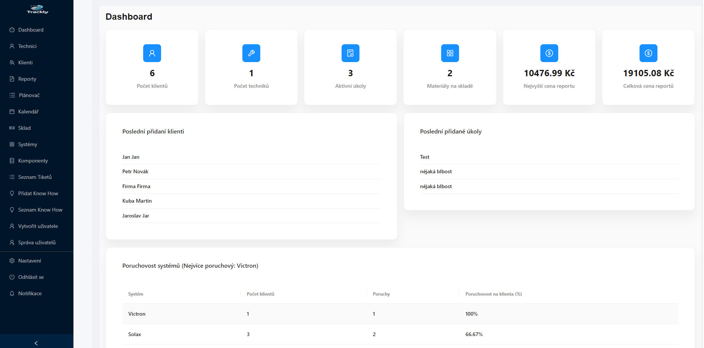
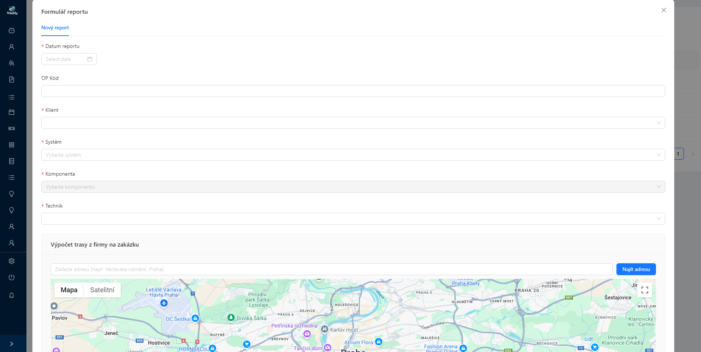
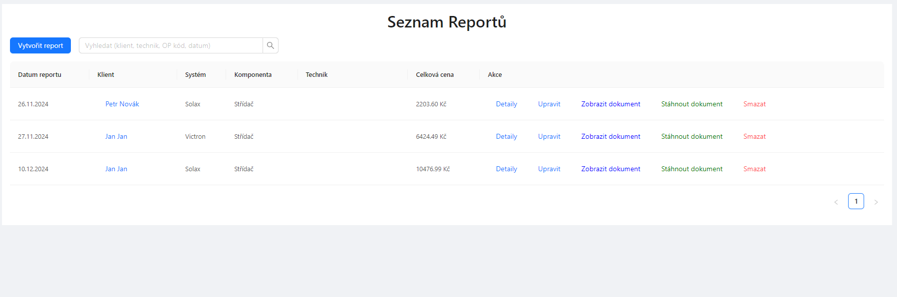
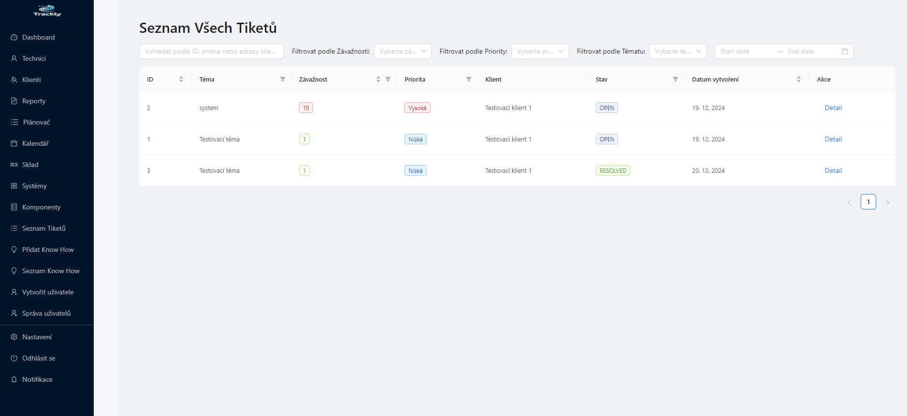

# 🚀 Trackly - Univerzální platforma pro správu týmů a projektů

[](https://opensource.org/licenses/Apache-2.0)
[](https://reactjs.org/)
[](https://nodejs.org/)
[](https://socket.io/)
[](https://www.postgresql.org/)
[](https://ant.design/)
[](https://github.com)
[](https://github.com)
[](https://github.com)
[](https://github.com)
[](https://github.com)
[](https://github.com)
[](https://github.com)
[](https://github.com)
[](https://github.com)


**Poznámka**: Aplikace je stále ve fázi vývoje. Funkce a rozhraní se mohou měnit.

**Trackly** je všestranná webová aplikace, která pomáhá týmům snadno spravovat úkoly, projekty, zdroje a klienty. Díky své modularitě je ideální pro oblasti, jako jsou IT projekty, služby zákazníkům, výroba nebo správa majetku.

---

## 🛠 Hlavní vlastnosti
- 🌐 **Správa uživatelů a rolí**: Přihlášení a správa uživatelů s různými oprávněními (admin, technik, klient).
- 🎫 **Systém ticketů**:
  - Klienti si mohou sami vytvářet tickety s detaily o problémech nebo požadavcích.
  - Tickety lze rozdělit podle závažnosti, kterou nastavují technici.
  - Každé téma ticketu může obsahovat připojené know-how, které lze zpřístupnit buď pouze technikům, nebo i klientům.
  - Tickety zahrnují integrovaný chat, který umožňuje efektivní komunikaci mezi klientem a technikem.
- 📅 **Kalendář a plánovač**:
  - Organizace servisních úkolů a projektů.
  - Přehledné plánování s vizualizací termínů a přidělených úkolů.
- 🗂️ **Plánování projektů a úkolů**: Flexibilní systém pro plánování, sledování a notifikace termínů.
- 🏗️ **Správa zdrojů a zásob**: Sledování materiálů a jejich využití ve skladech.
- 📑 **Generování reportů**: Automatické vytváření podrobných přehledů o projektech a nákladech.
- 🔔 **Notifikace v reálném čase**: Integrovaný systém upozornění pomocí **Socket.IO**.
- 📂 **Správa souborů**: Umožňuje nahrávání, prohlížení, stahování a organizaci souborů.
- 🛡️ **Bezpečnost**: Ověření uživatelů pomocí JWT a ochrana přístupu k datům.

---

## 💻 Technologie
### Frontend
- ⚛️ [React.js](https://reactjs.org/)
- 🎨 [Ant Design](https://ant.design/)
- 📱 [Bootstrap](https://getbootstrap.com/)
- 🌐 [React Router](https://reactrouter.com/)
- 🔌 [Socket.IO Client](https://socket.io/)

### Backend
- 🟩 [Node.js](https://nodejs.org/)
- 🚂 [Express.js](https://expressjs.com/)
- 🛢️ [Sequelize](https://sequelize.org/) (PostgreSQL)
- ✉️ [Nodemailer](https://nodemailer.com/)
- 🔌 [Socket.IO Server](https://socket.io/)

---

## 🛠️ Instalace a spuštění
1. **Naklonujte repozitář:**
   ```bash
   git clone https://github.com/uzivatel/trackly.git
   cd trackly
   
## Nainstalujte závislosti:
  # Backend
    cd backend
    npm install

  # Frontend
  
1. **V kořenové složce stačí pustit:**
   ```bash
   npm install

    
## Nastavte prostředí:

 #V adresáři backend vytvořte soubor .env a přidejte proměnné pro konfiguraci databáze, API klíče atd.
1. **V kořenové složce stačí pustit:**
   ```bash
    # Backend env
    DB_NAME=example_db
    DB_USER=example_user
    DB_PASSWORD=example_password
    DB_HOST=localhost
    DB_PORT=5432
    GOOGLE_MAPS_API_KEY=AIzaSyD-example-Google-Maps-API-Key
    JWT_SECRET=supersecretkey123

    # Gmail SMTP Credentials
    GMAIL_USER=example@gmail.com
    GMAIL_APP_PASSWORD=example_app_password

    MAIN_TECHNICIAN_EMAIL=technician@example.com
    REACT_APP_SOCKET_URL=http://localhost:3000

Spusťte aplikaci:

# Backend
1. **V kořenové složce stačí pustit:**
 
   ```bash
    cd backend
    node index.js

# Frontend
1. **V kořenové složce stačí pustit:**
   ```bash
    npm start
   
Přístup k aplikaci: Otevřete http://localhost:3000 ve webovém prohlížeči.


## ✨ Ukázky

### 📋 Dashboard


### 📑 Reporty



### 🎫 Tickety



---

## 🛡️ Licence
Tento projekt je licencován pod licencí **Apache 2.0**. Podrobnosti naleznete v souboru [LICENSE](LICENSE).

---


